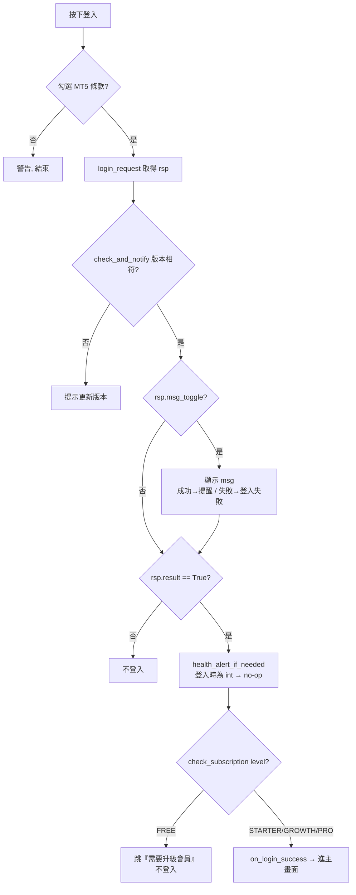
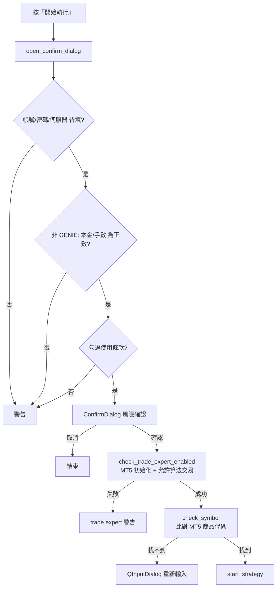

# MasQuant 中介程式 — 邏輯文件

> 本文件描述 `mas_exe`（MasQuant 桌面 EXE）的整體邏輯與資料流。
> 此程式是「使用者本機 MT5」與「mas 後端平台」之間的**中介程式（intermediary）**。
> 最後更新對應的程式狀態：登入契約改為 `msg_toggle`、方案分四級、訂閱不卡登入、
> 健康度不停止交易、三語系（en/zh/cn）、`IS_GENIE` 控制 UI。

---

## 1. 概觀

MasQuant EXE 是用 **PySide6 (Qt)** 寫的桌面 GUI 程式，職責是：

1. **登入驗證** — 把帳密 + 裝置資訊送到 mas 後端 `/api/intermediary/login`，由**後端**決定能否登入。
2. **方案 / 權限解析** — 依後端回傳的 `level`（FREE/STARTER/GROWTH/PRO）決定可用功能。
3. **本機跑策略** — 透過本機 **MetaTrader 5 (MT5)** 連線券商下單；策略邏輯在 `mas` lib + `bk_test.py`。
4. **流程 / 交易訊號 Log** — 右側雙 Log 面板即時顯示流程與進出場訊號。
5. **（可選）健康度監控** — 僅在 `IS_GENIE=True` 時，定期向後端查詢策略健康度並提醒。

```
┌─────────────┐    登入/健康度 API     ┌──────────────────┐
│  使用者 MT5  │ ◀──┐               ┌▶│   mas 後端平台     │
└─────────────┘    │               │ │ (dev/test/pd)     │
        ▲          │               │ └──────────────────┘
        │ 下單      │               │
        │      ┌────┴───────────────┴────┐
        └──────│   MasQuant EXE（中介）   │
               │  PySide6 GUI + mas lib   │
               └──────────────────────────┘
```

---

## 2. 架構與模組職責

| 層 | 檔案 | 職責 |
|---|---|---|
| **進入點** | `main.py` | 建 `QApplication`、組登入畫面 + 語言鈕、`on_login_success` callback |
| **UI - 登入** | `login.py` | `LoginForm`：帳密輸入、記住我、條款勾選、登入流程 |
| **UI - 主視窗** | `main_window.py` | `MainWindow`：雙 Log 面板、單例鎖、`start_with_user`、`closeEvent` 安全終止 |
| **UI - 策略設定** | `strategy_settings.py` | `StrategySettingsForm`（MT5 設定畫面）、`StrategyWorker`（QThread）、啟動/停止策略、健康度 UI |
| **邏輯 - 認證** | `auth.py` | `login_request`、`post_request`（防呆）、`get_access_by_level`、`get_strategy_health`、裝置指紋 |
| **邏輯 - 檢核** | `check.py` | 版本檢查、登入訊息、健康度顯示/提醒、方案 gate、彈窗 helper、`is_genai_enabled` |
| **設定 - 部署常數** | `env_info.py` | `UUID` / `HEALTH_TOKEN` / `IS_GENIE` / `ENV_VERSION` / `GENAI_EXE_VERSION` / `DEFAULT_LANG` |
| **設定 - URL/枚舉** | `enum_setting.py` | 環境感知的 `url` 枚舉、`info`（版本、監控間隔）、方案視覺對照 |
| **i18n** | `i18n_strings.py` | 三語系字典（en/zh/cn）、`switch_lang` 循環、`get_text`、方案標籤/顏色/圖示 |
| **策略 - 包裝** | `strategy.py` | `main` / `stop_main` 薄包裝，轉呼叫 `bk_test` |
| **策略 - 實作** | `bk_test.py` | `mas_client`（MA5/MA10 黃金交叉策略）、登入 MT5、訂閱 K 棒、下單 |
| **策略 - 商品檢核** | `check_symbol.py` | 用 MT5 `all_code` 比對商品代碼前綴，找出正確 symbol |
| **底層 lib** | `mas/` | 交易引擎（連線、下單、回測、資料回補）— 獨立函式庫，本程式不改它 |

---

## 3. 設定與環境

### 3.1 `env_info.py`（build 時嵌入的部署常數）

| 常數 | 目前值 | 用途 |
|---|---|---|
| `UUID` | `8332bd93-…` | 裝置/安裝實例識別碼，登入 payload 上送、健康度 API 預設 strategy id |
| `HEALTH_TOKEN` | 64 字元 hex | 健康度 API 的 `X-Health-Token` 認證 |
| `IS_GENIE` | `False` | **GENAI 健康度功能總開關**；同時控制多項 UI 顯隱（見 §9） |
| `ENV_VERSION` | `1` | 環境：`0=dev(localhost)` / `1=test` / `2=pd` |
| `GENAI_EXE_VERSION` | `"0.0.1"` | EXE 功能版本，登入 payload 上送 |
| `DEFAULT_LANG` | `"en"` | 預設語言常數（**目前未接線**，i18n 啟動語言仍寫死在 `i18n_strings.py`） |

> 換環境只要改 `ENV_VERSION` 重新 build；開關健康度改 `IS_GENIE`。

### 3.2 `enum_setting.py`（環境感知 URL）

- `info.base_url = (localhost:3000, mastest.mindaismart.com, mas.mindaismart.com)`，以 `ENV_VERSION` 當索引。
- `_base()` 回傳當前環境 base；所有 mas app route 都用 f-string 組在 `url` 枚舉裡：

| `url` 成員 | 路徑 | 用途 |
|---|---|---|
| `login` | `{base}/api/intermediary/login` | 登入 |
| `strategy_health` | `{base}/api/mas-genie/strategy-health` | 健康度（後接 `/{strategy_id}`） |
| `upgrade` | `{base}/plans` | 升級方案（FOOTER、各種升級提示連結） |
| `register` / `forget` / `strategy_wizard` | `{base}/…` | 註冊 / 忘記密碼 / 策略精靈 |
| `terms_api` / `terms_disclaimer` / `terms_ea_setting` / `offical` | `mindaismart.com/…`（固定，不切 env） | 條款 / 免責 / 操作文件 / 官網 |

> ⚠️ 凡是要連到 mas app 的連結都應走 `url` 枚舉，**不可寫死網址**（否則在 dev/test 會錯指到 pd）。

---

## 4. 啟動流程（`main.py`）

```
QApplication 建立
  → 設 icon / stylesheet
  → MainWindow()            # 先建好，但不 show
  → 語言切換鈕（右上角，循環 en→zh→cn）
  → LoginForm(on_login_success)
  → container（語言鈕 + 登入表單）show()
  → 進入 Qt 事件迴圈（app 開始接收事件）
```

- 登入成功 callback `on_login_success`：
  - 呼叫 `main_window.start_with_user(...)`。
  - 回 `False`（本機已有同帳號 session）→ 跳「重複登入」彈窗 + 結束程式。
  - 回 `True` → 關閉登入 container、`main_window.show()`。

---

## 5. 登入流程

### 5.1 送出（`auth.login_request` → `post_request`）

**payload 欄位：**

| 欄位 | 來源 |
|---|---|
| `email` / `password` | 使用者輸入 |
| `device_info` | `get_device_info()`：mac / hostname / platform / cpu / disk序號 / ip 的 JSON |
| `uuid` | `env_info.UUID` |
| `genai_exe_version` | `env_info.GENAI_EXE_VERSION` |
| `default_lang` | `get_current_lang()`（使用者當下選的語言 en/zh/cn） |
| `is_genie` | `env_info.IS_GENIE` |

**`post_request` 防呆**（任何傳輸失敗都回「契約相符」的錯誤，不靜默、不卡死）：

- `timeout=10`、`raise_for_status()`（4xx/5xx 含 404 → 例外）。
- 失敗一律回 `{"result": False, "msg_toggle": True, "msg": <在地化錯誤訊息>}`，
  `msg` 帶 detail（`HTTP 404` / `timeout` / `connection` / `invalid response` / `unknown`）。
- 成功（200 + JSON）→ 原樣回傳後端 rsp。

### 5.2 回應契約（伺服器全權決定）

| 欄位 | 型別 | 意義 |
|---|---|---|
| `result` | bool | **唯一**能否登入的依據（`True` 才進主畫面） |
| `msg_toggle` | bool | `True` → 顯示 `msg`（成功/失敗皆可附帶通知）。取代舊的 `code` 機制 |
| `msg` | str | 要顯示的訊息（支援 HTML）。由後端依 `default_lang` 在地化 |
| `level` | str | `FREE` / `STARTER` / `GROWTH` / `PRO` |
| `is_subsription` | bool | **已不卡登入**；僅影響 PRO 是否能多開 |
| `healthy` | int | `0=LOW` / `1=MEDIUM` / `2=HIGH`（登入時是 int，進主畫面才轉 dict） |
| `userId` `strategy_id` `symbol` `capital` `lots` `expire_date` | — | 成功登入時帶進主畫面初始化 |
| `access` | dict | **前端自算**：`login_request` 在 `result=True` 時用 `level` 推導 |

> 前端不再用 error code 對應本地訊息；失敗原因由後端 `msg` 提供（已移除 `LOGIN_ERROR_xxx`）。

### 5.3 `login_click` 判斷流程



### 5.4 單例鎖（`main_window.start_with_user` / `_acquire_local_session`）

- `is_pro = (level == "PRO" and is_subsription)`。
- **非 PRO 訂閱者**：用 `QSharedMemory`（key = `masquant_session_{user_id}`）取本機單例鎖；
  若已被另一 process 持有 → 回 `False` → 跳「重複登入」。
- **PRO 訂閱者**：放寬，不取鎖、允許多開。

---

## 6. 方案與權限

### 6.1 四級方案與報表權限階梯（`auth.get_access_by_level`）

| 方案 | normal_report | data_report | kpi_report | trade_report |
|---|:---:|:---:|:---:|:---:|
| **FREE** | ✓ | | | |
| **STARTER** | ✓ | ✓ | | |
| **GROWTH** | ✓ | ✓ | ✓ | |
| **PRO** | ✓ | ✓ | ✓ | ✓ |

- 視覺（`i18n_strings.LEVEL_*` 與 `enum_setting.dashboard.level_*`）：
  FREE=一般/灰、STARTER=入門/bronze、GROWTH=進階/silver、PRO=專業/gold。

### 6.2 登入 gate（`check.check_subscription`）

- **只有 `FREE` 會被擋**（跳「需要升級會員」，不進主畫面）。
- `STARTER` / `GROWTH` / `PRO` 一律放行 —— **訂閱與否已不卡登入**（`is_subsription` 參數保留但不使用）。
- `is_subsription` 唯一還在作用的地方：`main_window` 決定 PRO 能否多開。

---

## 7. 策略執行流程

### 7.1 進場前檢核（`StrategySettingsForm`）



- `check_trade_expert_enabled`：`mt5.initialize` + `terminal_info.trade_allowed` + `account_info.trade_expert`，任一不過就警告。
- `check_symbol`：`check_symbol.main` 登入 MT5、用 `connection.all_code` 比對前綴，取最短匹配；找不到讓使用者重打。

### 7.2 啟動與背景執行（`start_strategy` + `StrategyWorker`）

- `capital, lots = _get_selected_capital_lots()`（來源依模式，見 §9）。
- 建 `StrategyWorker`（`QThread`），連三個 signal：
  - `progress_signal` → `update_process_log`（流程 Log）
  - `backtest_log_signal` → `update_backtest_log`（交易訊號 Log）
  - `result_signal` → `handle_worker_result`（成功/失敗狀態）
- `worker.start()`；停用「開始」、啟用「停止」。
- 若 `is_genai_enabled()`：立即 `_check_health()` 一次 + 啟動 `health_monitor_timer`（每 60 分）。
- `StrategyWorker.run()`（背景執行緒）→ `strategy.main(..., toggle=False, log, backtest_log)` → `bk_test.main()`：
  - 登入 MT5、設定 symbol/volume/capital。
  - 檢查開機前是否已持倉、回補歷史資料、`subscribe_bars` 啟動。
    - **持倉隔離（magic number）**：每隻 EXE 用 `crc32(env_info.UUID)` 推導唯一 `MAGIC`，
      下單時蓋在訂單上；開機回補**只認 `position.magic == MAGIC`** 的持倉。
      多隻不同策略 EXE 打同一標的、或使用者手動單（magic=0），互不干擾。
      ⚠️ 需券商帳戶為 hedging 模式（外匯/CFD 預設）；netting 模式同商品部位會合併，無法隔離。
  - `receive_bars()`：累積收盤價 → MA5 / MA10 → 黃金交叉做多、死亡交叉平倉 → `send_order`（帶 `magic`）。

### 7.3 停止與關閉

- `_handle_stop_click`（使用者按「停止」）→ `confirm_stop_strategy` 確認窗（預設選「取消」防誤觸）→ `stop_strategy`。
- `stop_strategy`：停健康度 timer → `on_stop_callback`（`strategy.stop_main` → `unsubscribe_bars`）→ `worker.wait(3000)` → 必要時 `terminate` → 狀態改「已停止」、還原按鈕。
- `closeEvent`（關視窗）：偵測到 worker 在跑就呼叫 `stop_strategy` 安全終止。

> **停止交易的唯一途徑：使用者按「停止」鈕、或關閉視窗。健康度不會停止交易（見 §8）。**

---

## 8. 健康度監控（僅 `IS_GENIE=True`）

### 8.1 取得（`auth.get_strategy_health`）

- `GET {base}/api/mas-genie/strategy-health/{strategy_id}`，
  headers：`X-Health-Token`（token）+ `X-Default-Lang`（當前語言）。
- `timeout=10`、`raise_for_status()`、僅接受 dict。
- **任何失敗（404 / 連線 / 逾時 / 非 JSON / 非 dict）都回 `None`**，且**靜默**（不跳錯誤窗）。

### 8.2 健康度回應契約

| 欄位 | 意義 |
|---|---|
| `healthLevel` | `HIGH` / `MEDIUM` / `LOW`（對應徽章 綠/橘/紅） |
| `action` | `CONTINUE` / `WARN` / `STOP`（`WARN`/`STOP` 才跳提醒） |
| `shouldStop` | bool（**目前不使用**：健康度不再自動停止交易） |
| `message` | 後端在地化訊息（優先顯示） |

- `healthy_from_login(int)`：把登入時的 int（0/1/2）正規化成 dict（`LOW`/`MEDIUM`/`HIGH`，
  `action = CONTINUE if HIGH else WARN`），讓下游一律處理 dict。

### 8.3 行為與三層防護

- `_check_health()`：更新徽章 + `health_alert_if_needed`（WARN/STOP 跳提醒）。**只顯示、只提醒，不停止交易。**
- 「false 時不檢測」由**三層**保證：
  1. `start_strategy` 用 `if is_genai_enabled():` 包住即時檢核與 timer 啟動。
  2. `health_monitor_timer` 只在該 gate 內 `.start()`，false 時永不啟動。
  3. `_check_health` 開頭 `if not is_genai_enabled(): return`（函式層自我把關）。
- `_check_health` 整段包 `try/except`：背景監控的任何例外都不得中斷交易或卡住 UI。

---

## 9. `IS_GENIE` 功能旗標的影響

`IS_GENIE=False` 時，MT5 設定畫面**不顯示任何 GENAI 專屬 UI**，且不做健康度檢核。

| 元件 / 行為 | `IS_GENIE=False` | `IS_GENIE=True` |
|---|---|---|
| 健康度徽章 + ⓘ 按鈕 | **不建立、不顯示** | 建立並顯示 |
| strategy id / symbol 標籤 | **不建立、不顯示**（不管 rsp 是否回傳） | 依資料顯示 |
| 資金規模（account size） | **本金 + 手數 兩個輸入框**（可自由輸入，預填 rsp/預設值） | 預設下拉選單（依後端建議的等比階梯） |
| 健康度檢核（API/timer） | **完全不執行**（0 次 API 呼叫） | 啟動時一次 + 每 60 分 |

- 非 GENIE 的本金/手數輸入：`_get_selected_capital_lots` 讀輸入框（`_parse_positive_float` 驗證），
  `open_confirm_dialog` 進場前也驗證為正數；壞值會擋下並提示，不會靜默套預設。
- GENIE 的下拉選單階梯（`_build_capital_lots_options`）：以預設為中心 ×0.1~×32 等比縮放，
  手數下限夾 0.01、同手數去重、必含預設值、本金整數縮放。

---

## 10. 多語系（i18n）

- 三語系：`en`（英文）、`zh`（繁中）、`cn`（簡中）。
- `switch_lang()` 循環：`en → zh → cn → en`；語言鈕顯示「下一個」目標語言。
- `get_text(key, lang=None)` → `i18n_map[lang][key]`，缺 key 時 fallback 到 `key.value`（繁中預設）。
  - ⚠️ 因此各語系字典**必須 key 完整**，否則會出現「簡繁混雜」且不報錯。
- 啟動語言目前寫死在 `i18n_strings.DEFAULT_LANG = "en"`（`env_info.DEFAULT_LANG` 尚未接線）。
- 方案標籤/顏色/圖示：`LEVEL_LABEL`（含 cn）、`LEVEL_COLOR`、`LEVEL_ICON`。

---

## 11. 防呆與錯誤處理彙整

| 位置 | 防呆 |
|---|---|
| `post_request`（登入） | 加 `timeout=10`；404/逾時/連線/非 JSON 都回 `result=False + msg_toggle=True + 在地化 msg`，使用者一定看到提示 |
| `login_request` | `rsp.get("result")` / `rsp.get("level")` 用 `.get`，避免後端缺 key 時 `KeyError` |
| `get_strategy_health`（健康度） | `timeout=10` + `raise_for_status` + dict 驗證；任何失敗回 `None`、**靜默**、不影響交易 |
| `_check_health` | 函式層 `if not is_genai_enabled(): return` + 整段 `try/except` |
| 資金規模輸入（非 GENIE） | `_parse_positive_float` 驗證正數；`open_confirm_dialog` 進場前擋下空白/亂填 |
| 健康度 UI / strategy id / symbol | `IS_GENIE=False` 時不建立（用 `None` 當哨兵），相關 refresh 方法以 `is None` 早退 |
| 彈窗寬度 | `_force_min_width`（layout spacer）撐最小寬度，避免標題列文字被截斷 |
| 持倉誤認（多 EXE 同標的） | 下單蓋 `MAGIC`（UUID 推導）、開機回補只認自己的 magic；別的 EXE 或手動單不會被誤判為本策略持倉 |
| `closeEvent` | 關視窗時安全終止策略執行緒 |

---

## 12. 名詞對照

| 詞 | 說明 |
|---|---|
| **中介程式 / intermediary** | 本 EXE；夾在使用者 MT5 與 mas 後端之間 |
| **GENIE / GENAI** | 後端的 AI 策略健康度功能；以 `IS_GENIE` 旗標開關 |
| **健康度 health** | 後端評估「使用者目前策略是否過時」的指標（HIGH/MEDIUM/LOW） |
| **方案 level** | 會員等級 FREE / STARTER / GROWTH / PRO |
| **單例鎖 single-instance lock** | 用 `QSharedMemory` 防同帳號在本機多開（PRO 訂閱者放寬） |
| **mas lib** | `mas/` 底層交易引擎，獨立函式庫，本程式不修改它 |
